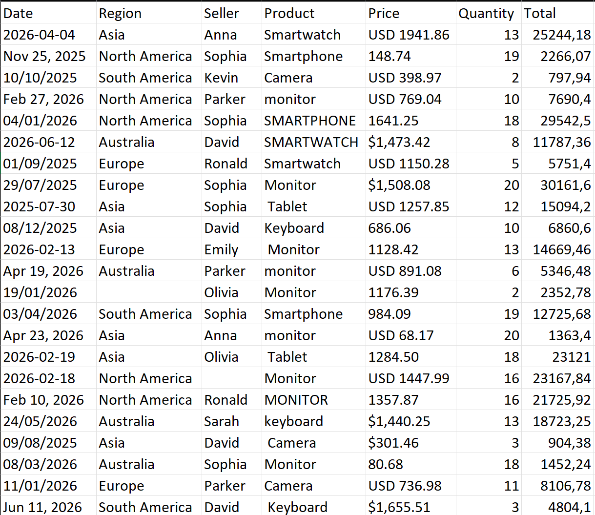
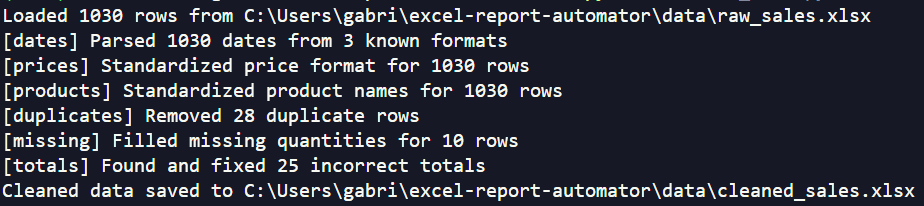
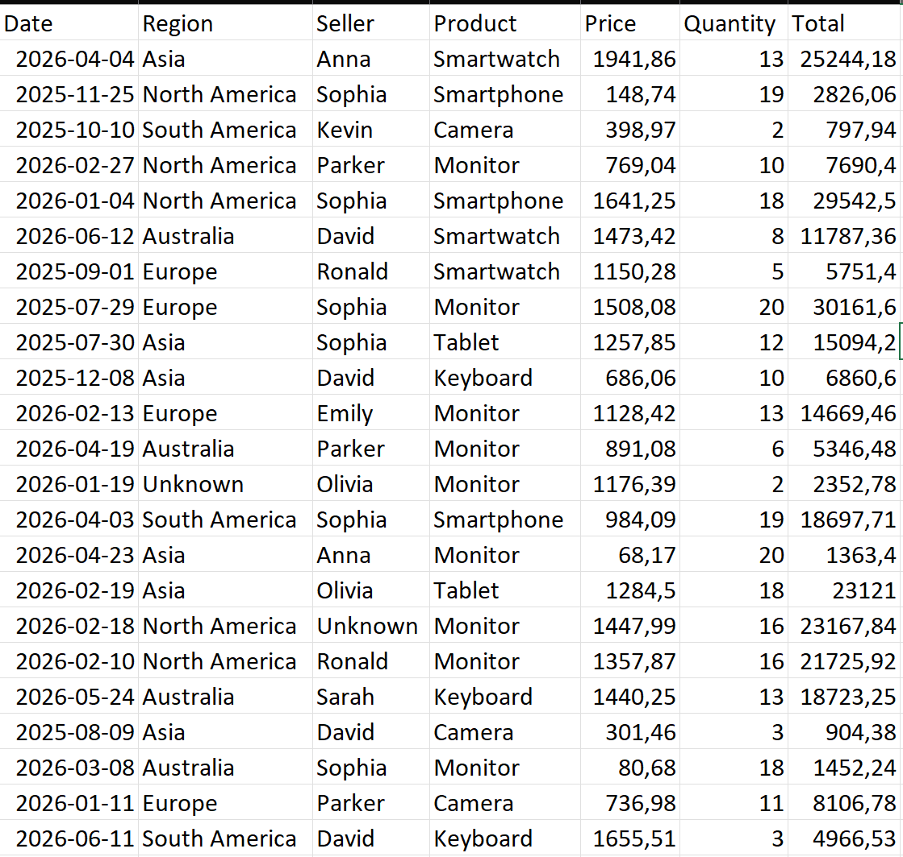
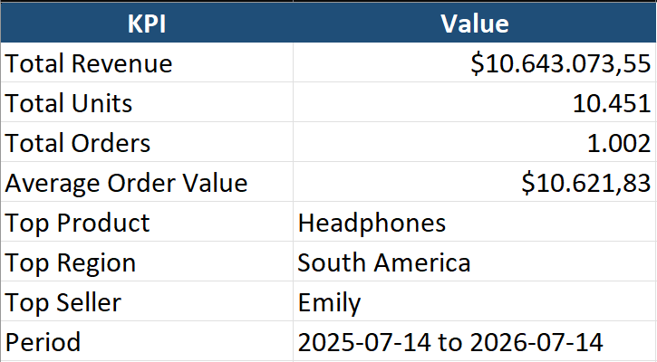

# Excel Report Automator

Turns messy sales spreadsheets into a clean, formatted Excel report — automatically.

Manual spreadsheet work is slow and error-prone: mixed date formats, prices stored
as text, duplicated rows, missing values, wrong totals. This project shows a
complete Python pipeline that fixes all of it and delivers an executive-ready
Excel report with KPIs and charts.

> **Note:** the input data is synthetic (generated with a fixed seed, fully
> reproducible). Sample input/output files are committed on purpose so you can
> inspect the before/after without running any code.

## The problem — real-world messy data

A 1,030-row sales spreadsheet with the classic problems:

- Dates in **3 different formats** in the same column (`2026-03-19`, `19/03/2026`, `Mar 19, 2026`)
- Prices stored as **text** (`$1,234.56`, `1234.56`, `USD 459.00`)
- **30 duplicated rows** scattered around
- **~40 missing cells** (seller, region, quantity)
- **25 wrong totals** (quantity × price doesn't match)
- Inconsistent product names (`Laptop`, `LAPTOP`, ` laptop `)



## The pipeline

| Script | What it does |
|---|---|
| `src/generate_data.py` | Creates the messy demo spreadsheet (seeded — same output every run) |
| `src/clean_data.py` | Parses dates from 3 known formats (no guessing), normalizes prices to numbers, standardizes product names, removes duplicates, **recovers missing quantities from Total ÷ Price instead of guessing**, detects and fixes wrong totals |
| `src/build_report.py` | Aggregates by product / region / seller / month and writes a formatted multi-sheet Excel report with KPIs and an embedded chart |

Every cleaning step reports what it did:



Result: 1,030 messy rows → **1,002 clean, typed, consistent rows**
(28 duplicates removed, 10 quantities recovered, 25 totals fixed, 0 issues left).



## The deliverable

A formatted `sales_report.xlsx` with five sheets — executive summary (revenue,
average order value, top product/region/seller), breakdowns by product, region
and seller, and a monthly trend with an embedded chart:



## How to run

```bash
git clone https://github.com/GabrielCardozo92/excel-report-automator.git
cd excel-report-automator
python -m venv venv
venv\Scripts\activate        # Windows (use source venv/bin/activate on Linux/Mac)
pip install -r requirements.txt

python src/generate_data.py   # create the messy demo file
python src/clean_data.py      # clean it
python src/build_report.py    # build the final report
```

Outputs: `data/cleaned_sales.xlsx` and `output/sales_report.xlsx`.

## Tech

Python · pandas · openpyxl · Faker

## Need something like this for your business?

This demo mirrors the work I do for clients: automating spreadsheet cleanup,
report generation, web scraping and data pipelines. If your team spends hours
on manual spreadsheet work every week, it can probably be automated — feel free
to reach out.
